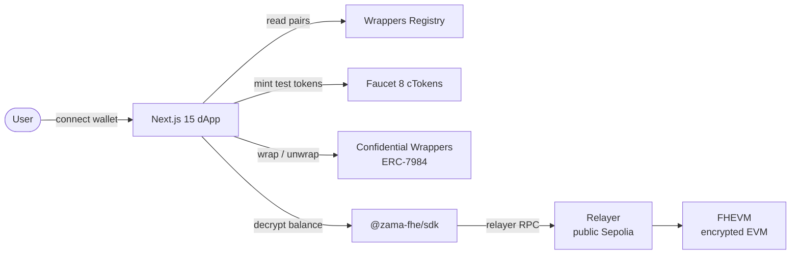
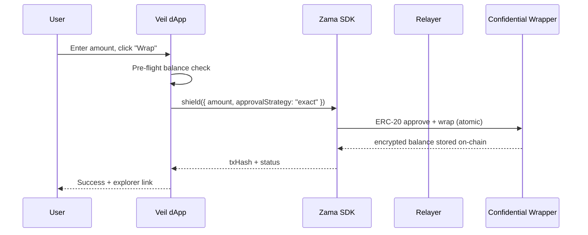
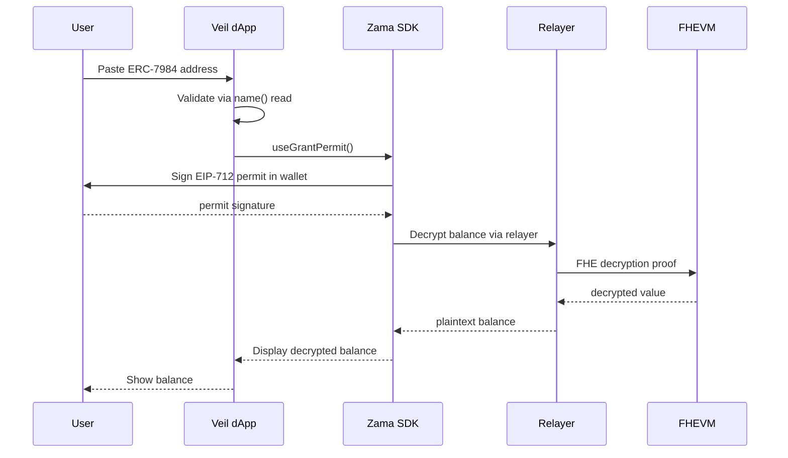

# Veil

> **Encrypted by default. Yours to reveal.**

[](LICENSE)
[](https://github.com/A-Raphie/veil/actions)
[](https://sepolia.etherscan.io/address/0x2f0750Bbb0A246059d80e94c454586a7F27a128e)
[](https://github.com/zama-ai/fhevm)
[](https://nextjs.org)

---

## The problem

Zama's on-chain **Confidential Wrappers Registry** lets anyone wrap a standard
ERC-20 into an ERC-7984 confidential token whose balance is encrypted. The
protocol is powerful, but interacting with it today requires stitching together
raw contract calls, relayer URLs, permit signatures, and decryption flows —
there's no single place to just *use* it.

## The solution

Veil turns the registry into a complete dApp. Browse every official wrapper pair,
claim test tokens from the faucet, wrap and unwrap in one click, and decrypt any
confidential balance — all from a clean UI backed by the official Zama SDK.

```ts
// Wrap any registry ERC-20 → ERC-7984 in one call
import { useShield } from "@zama-fhe/react-sdk"

const { shield } = useShield({ address: confidentialToken })
await shield({ amount: parseUnits("100", 6), approvalStrategy: "exact" })
```

Built on **Zama FHEVM** with `@zama-fhe/sdk` v3. Runs on **Sepolia**.

---

## See it live

- **dApp:** https://veil-registry.vercel.app
- **GitHub:** https://github.com/A-Raphie/veil
- **Video demo:** https://x.com/A_raphie/status/2074401773465256322
- **X article:** https://x.com/A_raphie/status/2074401773465256322
- **Network:** Sepolia (11155111)

---

## Architecture



### Wrap flow (one-click)



### Decrypt flow (EIP-712 permit)



---

## Capabilities

| Route | Feature | What it does |
|---|---|---|
| `/` | **Registry browser** | Reads the live on-chain Wrappers Registry and renders every ERC-20 ↔ ERC-7984 pair with full metadata + addresses. Merges any local dev pairs. |
| `/faucet` | **Sepolia faucet** | Mints the official `cTokenMock` underlying tokens (1,000,000 units/call) with per-token balance + tx status. |
| `/wrap` | **Wrap & unwrap** | Wraps ERC-20 → ERC-7984 (auto-approves) and unwraps back — the SDK orchestrates the on-chain two-step (request → public decrypt → finalize) in one click. Live balance panels for both sides. |
| `/decrypt` | **Decrypt balance** | Decrypts the connected wallet's balance for any ERC-7984 token via a one-time EIP-712 permit. Paste-an-address or pick from the registry; input is syntactically validated. |

Every transaction surfaces pending → success (with explorer link) → error states inline, plus a toast system.

---

## On-chain proof

Real transactions on Sepolia, executed with wallet
[`0x2051cDC7Bf2954123dd98Fe4e6ce097AC5A27047`](https://sepolia.etherscan.io/address/0x2051cDC7Bf2954123dd98Fe4e6ce097AC5A27047):

| Action | Tx Hash | Block | Explorer |
|---|---|---|---|
| Faucet mint (8 tokens) | `0xe3fd43cdd71e04647c60453241f4dd8930c99067151da9b322d8e3b7187500cb` | 11209388 | [View](https://sepolia.etherscan.io/tx/0xe3fd43cdd71e04647c60453241f4dd8930c99067151da9b322d8e3b7187500cb) |
| Wrap USDC | `0xd9fa067c4affa5c75fb2b2e5186b7161d2a0c79a064f8e84774bb4efd75a14f6` | 11208527 | [View](https://sepolia.etherscan.io/tx/0xd9fa067c4affa5c75fb2b2e5186b7161d2a0c79a064f8e84774bb4efd75a14f6) |
| Wrap USDT | `0xab59d0cd77eeee4139208f9b90744e0ac315cc74fedad5b7db0884a43adf9644` | 11208537 | [View](https://sepolia.etherscan.io/tx/0xab59d0cd77eeee4139208f9b90744e0ac315cc74fedad5b7db0884a43adf9644) |
| Unwrap USDC | `0xd4e66928937ff5485147f6553677ab22a7e459b6700579867c6f4056a45b14f2` | 11207701 | [View](https://sepolia.etherscan.io/tx/0xd4e66928937ff5485147f6553677ab22a7e459b6700579867c6f4056a45b14f2) |
| Decrypt | SDK permit flow — no standalone on-chain tx | — | — |

---

## Security

| Layer | Mechanism | Enforcement point |
|---|---|---|
| **Config validation** | Rejects bad addresses, duplicate wrappers, out-of-range decimals — fails loudly at load time | `packages/registry-config/src/index.ts:78–131` |
| **Address validation** | Client-side EIP-55 checksum via viem `isAddress()` + `getAddress()` on all user inputs | `apps/web/src/lib/address.ts:23–26` |
| **Transaction lifecycle** | `TxState` discriminated union (`idle → pending → success \| error`); every tx transitions through the full lifecycle inline | `apps/web/src/components/transaction-status.tsx:13–66` |
| **Relayer key isolation** | Sepolia relayer is open (no key); mainnet proxy isolates API key server-side | `apps/web/src/app/api/relayer/[chainId]/route.ts:14,58` |
| **Test-only guard** | Faucet buttons disabled on unsupported chains; mainnet relayer proxy rejects Sepolia requests | `apps/web/src/app/faucet/page.tsx:60`, `apps/web/src/app/api/relayer/[chainId]/route.ts:27` |
| **Cross-origin isolation** | COOP/COEP headers on all routes — required for FHE WASM `SharedArrayBuffer` in Web Workers | `apps/web/next.config.mjs:15–16` |

---

## Supported networks

| Network | Chain ID | Registry | Faucet |
|---|---|---|---|
| **Sepolia** | 11155111 | [`0x2f0750Bbb0A246059d80e94c454586a7F27a128e`](https://sepolia.etherscan.io/address/0x2f0750Bbb0A246059d80e94c454586a7F27a128e) | ✅ 8 cTokenMocks |

Canonical addresses in [`packages/contracts/src/addresses.ts`](packages/contracts/src/addresses.ts).

---

## Tech stack

| Layer | Technology |
|---|---|
| **Framework** | Next.js 15 (App Router) + React 18 + TypeScript (strict) |
| **Wallet** | wagmi v3 + viem v2 |
| **FHE** | `@zama-fhe/sdk` + `@zama-fhe/react-sdk` v3.2.0 |
| **Styling** | Tailwind CSS with custom design tokens |
| **Tooling** | pnpm workspace monorepo |

<details>
<summary><strong>Monorepo layout</strong></summary>

```
veil/
├── apps/web/                     # Next.js dApp
│   ├── src/app/                  # routes: /, /faucet, /wrap, /decrypt, /api/relayer/[chainId]
│   ├── src/components/           # hero, nav, wallet, tx-status, alert, skeleton, toast
│   ├── src/lib/                  # registry reader, format, errors, address validation
│   ├── src/config/networks.ts    # wagmi + Zama SDK config (client-only)
│   ├── public/                   # favicon.svg, og-image.png
│   └── next.config.mjs           # COOP/COEP headers (required for FHE WASM)
├── packages/contracts/           # ABIs + canonical Sepolia addresses
└── packages/registry-config/     # typed local-config schema + validation + add-pair CLI
```

</details>

---

## Configuration

### Zero-config on Sepolia

The **Sepolia testnet relayer is open** (`https://relayer.testnet.zama.org/v2`, no
key required, verified empirically), so the entire bounty-judging flow works with
**zero configuration**. Veil points the SDK straight at the public Sepolia host.

### Cross-origin isolation (already configured)

FHE WASM runs in a Web Worker and needs `SharedArrayBuffer`, which requires
COOP/COEP headers — set in `next.config.mjs`. If a third-party wallet iframe
ever breaks, switch the embedder policy to `credentialless` as a fallback.

---

## Local development

**Prerequisites:** Node ≥ 22, pnpm ≥ 10.

```bash
pnpm install
pnpm dev          # http://localhost:3000
```

Other scripts:

```bash
pnpm build        # production build
pnpm start        # serve the production build
pnpm typecheck    # tsc --noEmit across all packages
pnpm add-pair     # add a custom ERC-20 ↔ ERC-7984 pair (see below)
```

---

<details>
<summary><strong>Adding a new ERC-20 ↔ ERC-7984 pair</strong></summary>

The on-chain registry is read-only for non-DAO accounts. Veil supports **three
mechanisms** for adding custom or dev-only pairs — all produce the same result
(a pair in the registry grid with a `local` badge, fully wrap/unwrap/decrypt-able).

### Option 1 — In-browser admin UI (easiest)

On the registry page, click **"Add a custom pair"** at the bottom of the grid.
Fill in the symbol, wrapper address, underlying address, and decimals. The pair
is validated and appears instantly. Pairs persist in your browser (localStorage)
and survive page refresh.

### Option 2 — CLI (for build-time / persisted config)

```bash
pnpm add-pair
# or non-interactive:
pnpm add-pair \
  --symbol MYTKN \
  --confidential 0xYOUR_ERC7984 \
  --underlying 0xYOUR_ERC20 \
  --name "My Confidential Token" \
  --decimals 6 \
  --faucetable
```

This writes a validated entry to `pairs.local.json`. Run `pnpm dev` (or rebuild)
and the pair appears in the registry browser with a `local` badge. See
`pnpm add-pair --help` for all flags.

### Option 3 — Manual JSON edit

Copy `pairs.local.example.json` → `pairs.local.json` in `packages/registry-config/`
and edit by hand:

```jsonc
{
  "pairs": [
    {
      "symbol": "MYTKN",
      "name": "My Confidential Token",
      "decimals": 6,
      "confidentialToken": "0x…yourERC7984",
      "underlying": "0x…yourERC20",
      "faucetable": false
    }
  ]
}
```

All three paths are validated (`parseLocalConfig`): bad addresses, duplicate
wrappers, and out-of-range decimals throw with the offending entry index, so
misconfigurations fail loudly. On a collision, the on-chain registry wins.

### Worked example: a custom wrapper deployed on Sepolia

We deployed a custom `ConfidentialWrapper` on Sepolia to demonstrate the full
extensibility flow end-to-end:

| Field | Value |
|---|---|
| **Wrapper (ERC-7984)** | [`0x2286e6d1144163d0315977f341d06D8Ce7df5234`](https://sepolia.etherscan.io/address/0x2286e6d1144163d0315977f341d06D8Ce7df5234) |
| **Underlying (ERC-20)** | [`0x9b5Cd13b8eFbB58Dc25A05CF411D8056058aDFfF`](https://sepolia.etherscan.io/address/0x9b5Cd13b8eFbB58Dc25A05CF411D8056058aDFfF) (USDC Mock) |
| **Symbol / Name** | cDEMO / Confidential Demo USDC |
| **Decimals** | 6 |

Deployed via Zama's `protocol-apps` Hardhat task (`task:deployConfidentialWrapper`).
To add it in the UI: open "Add a custom pair," paste the wrapper address — Veil
auto-fills name, symbol, decimals, and underlying from the contract, validates
on-chain, and the pair appears with a `local` badge.

</details>

---

## Deployment (Vercel)

1. Push the repo to GitHub.
2. Import into Vercel — the `veil-web` workspace is auto-detected.
3. Set `NEXT_PUBLIC_SITE_URL` to your deployed URL (for OG metadata).
4. Deploy. COOP/COEP headers apply automatically via `next.config.mjs`.

---

## Judging alignment

### Coverage

All 8 official Sepolia cTokenMocks are surfaced and functional:
- 7 mocked (faucetable): USDC, USDT, WETH, BRON, ZAMA, tGBP (6 dec), XAUt
- 1 restricted (non-mocked): tGBP (18 dec)
- Plus 1 community pair: steakcUSDC
- On-chain registry is the primary source; local config and UI-added pairs merge in

### Correctness

- **Wrap:** `useShield` with `approvalStrategy: "exact"` handles approve + wrap atomically via the SDK
- **Unwrap:** `useUnshield` with staged callbacks (`onUnwrapSubmitted` → `onFinalizeSubmitted`) for the two-step unshield flow
- **Decrypt:** EIP-712 permit via `useGrantPermit`, balance read via `useConfidentialBalance`, contract validation via `name()`/`decimals()` read (supportsInterface reverts on FHE ACL-gated wrappers)
- **On-chain proof:** 4 real Sepolia tx hashes with block numbers and explorer links

### Extensibility

Three documented paths for adding pairs:
1. **In-browser UI** — "Add a custom pair" form that auto-fills name, symbol, decimals, and underlying from the wrapper contract, then validates on-chain that both addresses are real contracts
2. **CLI** — `pnpm add-pair --symbol MYTKN --confidential 0x... --underlying 0x...`
3. **Manual JSON** — edit `pairs.local.json` directly

All paths share `parseLocalConfig` validation. On collision, the on-chain registry wins.

### UX

- One-click wrap/unwrap with pre-flight balance check
- Per-token faucet with "Claim All" batch button
- Paste-an-address decrypt with registry picker shortcut
- WrongNetworkBanner with one-click switch to Sepolia
- Transaction state machine: pending → success (explorer link) → error, inline + toast
- Skeleton loading states on all async data
- Mobile-responsive nav with drawer

### Code quality

- TypeScript strict mode across all 3 packages
- `TxState` discriminated union for all transaction lifecycle
- EIP-55 address validation on every user input
- `humanizeError` covers 20+ error patterns (SDK, wallet, network, relayer)
- Error boundary with humanized messages
- No debug console output in production
- SSR-safe: Zama SDK assembled only in client providers

### Production readiness

- Zero-config Sepolia: public relayer, no API keys needed
- COOP/COEP headers for FHE WASM SharedArrayBuffer
- Vercel deployment with auto-detected monorepo workspace
- CI pipeline: typecheck + build on push/PR to main

---

## Current status

**Implemented and working:**
- On-chain Wrappers Registry reader with local config + UI pair merge
- Sepolia faucet with per-token mint and "Claim All" batch
- Wrap (shield) and unwrap (unshield) with auto-approve
- EIP-712 permit-based decrypt for any ERC-7984 (registry or arbitrary address)
- Transaction state machine with inline explorer links + toast feedback
- WrongNetworkBanner with one-click Sepolia switch
- Three-path pair addition (browser UI, CLI, manual JSON) with shared validation
- COOP/COEP headers for FHE WASM
- CI pipeline (typecheck + build)
- Zero-config on Sepolia (no API keys)

**Not in scope for this submission:**
- Mainnet support (FHEVM contracts require Zama's coprocessor, not available via standard RPCs)
- Video demo (record before submission deadline)
- X thread (publish before submission deadline)

---

## What's next

- Additional wrapper pairs as the Protocol DAO registers them
- Batch decrypt (multiple tokens in one permit)

---

## Acknowledgements

- [Zama FHEVM](https://github.com/zama-ai/fhevm) — fully homomorphic encryption for EVM.
- [@zama-fhe/sdk](https://docs.zama.org/protocol/sdk) v3 — React hooks for shield/unshield/decrypt.
- [Confidential Wrappers Registry](https://docs.zama.org/protocol/protocol-apps/confidential-tokens/wrapper-registry) — on-chain pair directory.

---
